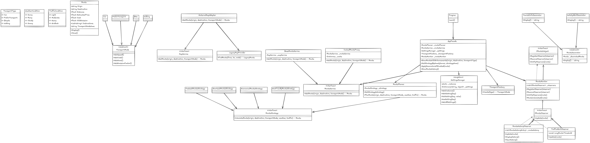

# Sistema de Recomendação de Rotas - ETAPA-2

## Descrição

O Sistema de Recomendação de Rotas é uma aplicação de console que demonstra a implementação e integração de múltiplos padrões de design para criar um sistema de planejamento de rotas urbanas. Este projeto foi desenvolvido como parte da disciplina POO-II da Universidade Federal de São Paulo (UNIFESP).

## Padrões de Design Implementados

O projeto implementa os seguintes padrões de design:

1. **Strategy** - Diferentes algoritmos para cálculo de rotas (mais rápida, mais curta, mais econômica, mais ecológica)
2. **Factory Method** - Criação de diferentes meios de transporte (carro, transporte público, bicicleta, a pé)
3. **Singleton** - Gerenciador de configurações globais do sistema
4. **Proxy** - Cache de rotas para melhorar a performance do sistema
5. **Adapter** - Integração com um serviço de mapas legado
6. **Decorator** - Aprimoramento das rotas com informações adicionais (turísticas e de segurança)
7. **Observer** - Monitoramento e notificações sobre rotas (histórico e alertas de tráfego)
8. **Facade** - Simplificação da interface para cálculo e exibição de rotas

## Estrutura do Projeto

O projeto está organizado em diretórios que representam os diferentes padrões de design:

```
etapa-2-code-patterns/
├── Models/                 # Classes de modelo
│   ├── Enums.cs            # Enumerações do sistema
│   └── Route.cs            # Classe para representar rotas
├── Strategies/             # Implementação do padrão Strategy
│   ├── RouteStrategy.cs    # Interface de estratégia
│   ├── FastestRouteStrategy.cs
│   ├── ShortestRouteStrategy.cs
│   ├── EconomicalRouteStrategy.cs
│   └── EcoFriendlyRouteStrategy.cs
├── Core/                   # Classes principais do sistema
│   └── RoutePlanner.cs     # Planejador de rotas
├── Factory/                # Implementação do padrão Factory Method
│   ├── TransportMode.cs    # Classe base e implementações de meios de transporte
│   └── TransportFactory.cs # Fábrica para criação de meios de transporte
├── Singleton/              # Implementação do padrão Singleton
│   └── SettingsManager.cs  # Gerenciador de configurações globais
├── Adapter/                # Implementação do padrão Adapter
│   ├── MapService.cs       # Interface e implementação do serviço de mapas
│   └── ExternalMapAdapter.cs # Adaptador para o serviço de mapas legado
├── Proxy/                  # Implementação do padrão Proxy
│   ├── RouteService.cs     # Interface e implementação base do serviço de rotas
│   └── CachedRouteProxy.cs # Proxy com cache para o serviço de rotas
├── Decorator/              # Implementação do padrão Decorator
│   └── RouteDecorator.cs   # Decoradores para rotas
├── Observer/               # Implementação do padrão Observer
│   └── RouteObserver.cs    # Observadores para monitoramento de rotas
├── Facade/                 # Implementação do padrão Facade
│   └── AppFacade.cs        # Fachada para simplificar o uso do sistema
└── Program.cs              # Ponto de entrada da aplicação
```

## Funcionalidades

O sistema oferece as seguintes funcionalidades:

1. **Cálculo de Rotas**: Calcula rotas entre dois pontos usando diferentes estratégias e meios de transporte
2. **Histórico de Rotas**: Mantém um histórico das rotas calculadas anteriormente
3. **Configurações do Sistema**: Permite personalizar as configurações do sistema, como estratégia padrão, meio de transporte padrão e outras opções
4. **Informações Adicionais**: Aprimora as rotas com informações turísticas e alertas de segurança
5. **Notificações**: Gera alertas e notificações relacionados às rotas, como alertas de tráfego

## Como Executar

Para executar o sistema, você precisará do .NET Core SDK instalado. Em seguida, siga estes passos:

1. Clone o repositório
2. Navegue até o diretório do projeto
3. Execute o comando `dotnet run`

```
git clone <url-do-repositorio>
cd etapa-2-code-patterns
dotnet run
```

## Interface do Usuário

O sistema possui uma interface de console em português que permite:

1. Calcular novas rotas
2. Visualizar o histórico de rotas
3. Configurar opções do sistema
4. Visualizar informações sobre o sistema

## Diagrama UML



*Observação: O diagrama UML está disponível no arquivo diagram.png na raiz do projeto.*

## Considerações Sobre a Implementação

Este projeto demonstra como diferentes padrões de design podem ser integrados para criar um sistema coeso e de fácil manutenção. Algumas observações importantes:

1. **Testabilidade**: A arquitetura baseada em interfaces facilita a criação de testes unitários.
2. **Extensibilidade**: Novos tipos de transporte, estratégias de rota e decorações podem ser adicionados sem modificar o código existente.
3. **Desacoplamento**: Os componentes do sistema estão desacoplados, permitindo alterações isoladas.
4. **Reusabilidade**: Vários componentes podem ser reutilizados em diferentes contextos.

## Autores

Desenvolvido para a disciplina de POO-II da UNIFESP.

## Licença

Este projeto está licenciado sob a licença MIT - consulte o arquivo LICENSE para obter mais detalhes.
